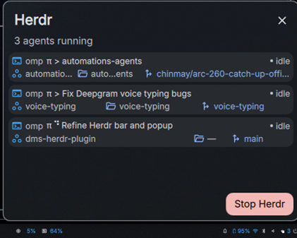

# Herdr for DankMaterialShell

A compact [DankMaterialShell](https://danklinux.com/docs/dankmaterialshell/) widget for monitoring and controlling local [Herdr](https://herdr.dev/) coding agents from DankBar.



## Features

- Shows the active agent count in DankBar.
- Lists each agent's type, prompt or thread title, status, workspace, worktree, and Git branch.
- Uses compact, theme-aware layouts on horizontal and vertical bars.
- Starts Herdr when the local server is stopped.
- Stops the running Herdr server from the popup.
- Polls independently on each monitor without cross-monitor state conflicts.

## Requirements

- DankMaterialShell 1.5 or newer
- `herdr` available on `PATH`
- `git` available on `PATH`

## Installation

Clone the plugin into the DankMaterialShell plugin directory:

```bash
git clone https://github.com/cxnmai/dms-herdr-plugin.git \
  ~/.config/DankMaterialShell/plugins/Herdr
```

Ask DMS to discover and enable it:

```bash
dms ipc call plugin-scan scan
dms ipc call plugins enable herdr
```

Open **DMS Settings → DankBar → Widgets**, then add **Herdr** to the desired bar section. If the widget does not appear immediately, reload DMS:

```bash
dms restart
```

## Usage

The DankBar pill displays the Herdr mark and current agent count. Click it to open the popup.

When Herdr is running, the popup shows two compact lines per agent:

1. Agent type, prompt or thread title, and status
2. Workspace, worktree name, and Git branch

When Herdr is stopped, the popup offers a start action. **Stop Herdr** shuts down the running local server.
